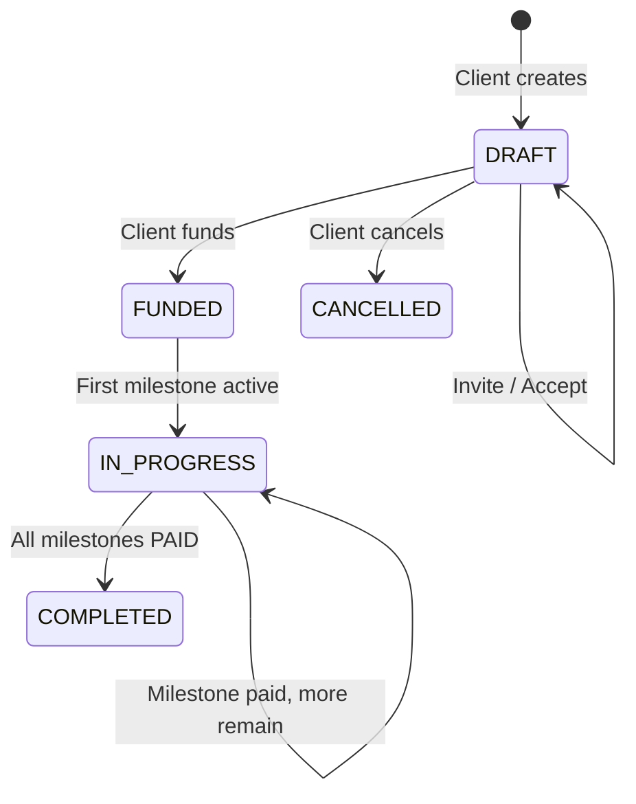
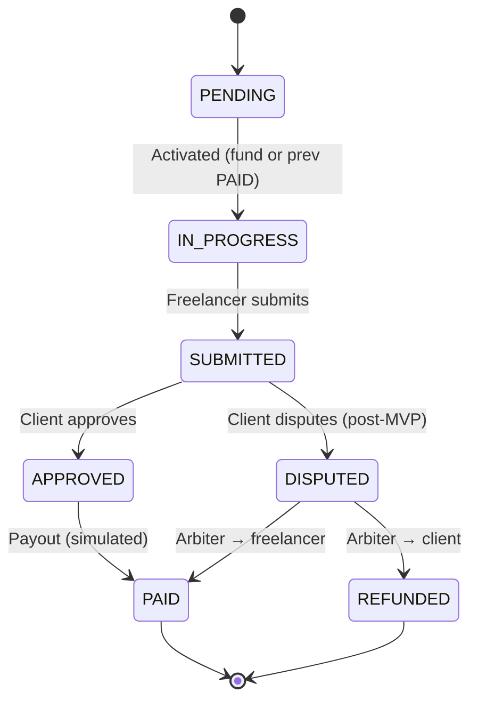

# Project Lifecycle

> **Source of truth for status transitions and who may do what.**  
> Enums: `backend/prisma/schema.prisma`  
> MVP scope: [PROJECT_OVERVIEW.md](./PROJECT_OVERVIEW.md) (disputes/reviews out of scope)

---

## Roles

A user has a global `Role` (`CLIENT`, `FREELANCER`, `ARBITER`, `ADMIN`), but **project actions are determined by project membership**, not only by global role.

| Project role | How assigned | Typical actions |
|--------------|--------------|-----------------|
| **Client** | `project.clientId` — creator | Create, edit (DRAFT), invite, fund, approve milestones, cancel (DRAFT) |
| **Freelancer** | `project.freelancerId` — after invite accept or application accept | Accept invite, submit work |
| **Arbiter** | `project.arbiterId` — optional, future | Resolve disputes *(post-MVP)* |
| **Admin** | Platform role | Moderation *(placeholder only in MVP)* |

**Rule:** An endpoint must verify the caller is the correct participant on that project (e.g. only `clientId` may fund or approve).

---

## Happy path (MVP)

```
Client:     Create → Invite → Fund
Freelancer:        Accept → Submit
Client:                      Approve → (next milestone) → … → Project COMPLETED
```

---

## Project status (`ProjectStatus`)

| Status | When | Escrow | Next states |
|--------|------|--------|-------------|
| **DRAFT** | Project created; not yet funded | `NOT_FUNDED` | `FUNDED`, `CANCELLED` |
| **FUNDED** | Client funded escrow; work authorized | `FUNDED` | `IN_PROGRESS`, `CANCELLED` *(refund — post-MVP)* |
| **IN_PROGRESS** | At least one milestone is active (not all terminal) | `FUNDED` → partial `RELEASED` | `COMPLETED` |
| **COMPLETED** | All milestones reached a terminal state (`PAID` or `REFUNDED`) | `RELEASED` *(fully)* | — |
| **CANCELLED** | Cancelled before meaningful work / payout | `REFUNDED` or `NOT_FUNDED` | — |

### Transitions (detail)

| From | To | Trigger | Actor |
|------|----|---------|-------|
| — | `DRAFT` | `POST /api/projects` | **Client** |
| `DRAFT` | `DRAFT` | Invite freelancer (`POST …/invite`) | **Client** |
| `DRAFT` | `DRAFT` | Freelancer accepts (`POST …/accept`) — `freelancerId` set | **Freelancer** |
| `DRAFT` | `FUNDED` | Fund project (`POST …/fund`) — sets `fundedAt`, `escrowStatus = FUNDED` | **Client** |
| `FUNDED` | `IN_PROGRESS` | First milestone set to `IN_PROGRESS` (automatic on fund) | *System* |
| `IN_PROGRESS` | `IN_PROGRESS` | Milestone paid; more milestones remain | *System* |
| `IN_PROGRESS` | `COMPLETED` | Last milestone → `PAID` (or all terminal) — sets `completedAt` | *System* |
| `DRAFT` | `CANCELLED` | Client cancels unfunded project | **Client** *(MVP)* |

> **Note:** `FUNDED` may be brief — on fund, the first milestone (`orderIndex = 0`) becomes `IN_PROGRESS` and the project moves to `IN_PROGRESS`. Design screen DS-D13 labels this “FUNDED + milestones IN_PROGRESS”; in code we use `IN_PROGRESS` once work has started.

---

## Milestone status (`MilestoneStatus`)

Milestones are ordered by `orderIndex`. Only **one** milestone should be active (`IN_PROGRESS` or `SUBMITTED`) at a time in MVP.

| Status | When | Who acts next |
|--------|------|---------------|
| **PENDING** | Created with project; not yet started | — |
| **IN_PROGRESS** | Active milestone; freelancer may deliver | **Freelancer** → submit |
| **SUBMITTED** | Freelancer delivered; awaiting client review | **Client** → approve *(or dispute — post-MVP)* |
| **APPROVED** | Client approved; payout pending | *System* → release → `PAID` |
| **PAID** | Escrow released to freelancer | — |
| **DISPUTED** | Client rejected / raised dispute | **Arbiter** *(post-MVP)* |
| **REFUNDED** | Funds returned to client | — *(post-MVP / cancellation)* |

### Transitions (detail)

| From | To | Trigger | Actor |
|------|----|---------|-------|
| — | `PENDING` | Project created with milestones | **Client** *(via create)* |
| `PENDING` | `IN_PROGRESS` | Previous milestone `PAID`, or first on fund | *System* |
| `IN_PROGRESS` | `SUBMITTED` | `POST /api/milestones/:id/submit` — creates `Submission` | **Freelancer** |
| `SUBMITTED` | `APPROVED` | `POST /api/milestones/:id/approve` — creates `Approval` | **Client** |
| `APPROVED` | `PAID` | Simulated payout — sets `paidAt`, `escrowStatus` partial release | *System* |
| `PAID` | `IN_PROGRESS` *(next)* | Next `PENDING` milestone activated | *System* |
| `SUBMITTED` | `DISPUTED` | Client raises dispute | **Client** *(post-MVP)* |
| `DISPUTED` | `PAID` / `REFUNDED` | Arbiter resolution | **Arbiter** *(post-MVP)* |

### Submission rules (MVP)

- Only the assigned **freelancer** on an `IN_PROGRESS` milestone may submit.
- `content` minimum 50 characters; `fileUrl` optional.
- Re-submit: new `Submission` row with incremented `version` *(if we allow revision — TBD in Week 4)*.

---

## Escrow status (`EscrowStatus`)

Parallel to project status; tracks money state (simulated in Phase 1).

| Status | When |
|--------|------|
| `NOT_FUNDED` | Project in `DRAFT`, no deposit |
| `FUNDED` | Client funded; full budget locked |
| `RELEASED` | One or more milestone payouts completed |
| `REFUNDED` | Cancelled or dispute resolved in client's favour |

---

## Action matrix (MVP)

What each role sees and may do on the UI — must match Figma / backend guards.

| Action | Actor | Preconditions | API | Status change |
|--------|-------|---------------|-----|---------------|
| Create project | **Client** | Logged in as client | `POST /api/projects` | Project → `DRAFT` |
| Edit project | **Client** | `DRAFT`, not funded | `PATCH /api/projects/:id` | — |
| Invite freelancer | **Client** | `DRAFT`, no freelancer yet | `POST …/invite` | — |
| Accept invite | **Freelancer** | Invited, not yet accepted | `POST …/accept` | `freelancerId` set |
| Fund project | **Client** | `DRAFT`, freelancer accepted | `POST …/fund` | Project → `FUNDED` → `IN_PROGRESS`, escrow → `FUNDED`, M0 → `IN_PROGRESS` |
| Submit work | **Freelancer** | Milestone `IN_PROGRESS`, assigned | `POST …/milestones/:id/submit` | Milestone → `SUBMITTED` |
| Approve & release | **Client** | Milestone `SUBMITTED` | `POST …/milestones/:id/approve` | Milestone → `APPROVED` → `PAID` |
| Cancel project | **Client** | `DRAFT`, not funded | `PATCH …/cancel` *(planned)* | Project → `CANCELLED` |
| Apply (job board) | **Freelancer** | Public project, Week 5 | `POST …/apply` | — |
| Accept application | **Client** | Has applications | `POST …/applications/:id/accept` | Same as invite accept |

### UI visibility (buttons hidden when)

| Surface | Role | Primary | Hidden when |
|---------|------|---------|-------------|
| MilestoneCard | Freelancer | Submit work | status ≠ `IN_PROGRESS` |
| MilestoneCard | Client | Review & approve | status ≠ `SUBMITTED` |
| Project detail | Client | Fund project | not `DRAFT` + freelancer accepted |
| Project detail | Client | Invite freelancer | freelancer already set, or not `DRAFT` |
| ProjectCard | Freelancer (pending) | Accept invite | already accepted |

---

## State diagram

### Project



### Milestone (single)



---

## Notifications & activity log

| Event | `NotificationType` | Recipient |
|-------|-------------------|-----------|
| Invited to project | `PROJECT_INVITED` | Freelancer |
| Work submitted | `MILESTONE_SUBMITTED` | Client |
| Milestone approved | `MILESTONE_APPROVED` | Freelancer |
| Dispute raised | `MILESTONE_DISPUTED` | Freelancer + Arbiter *(post-MVP)* |
| Dispute resolved | `DISPUTE_RESOLVED` | Both parties *(post-MVP)* |
| Payment released | `PAYMENT_RELEASED` | Freelancer |

`ActivityLog.action` examples: `PROJECT_CREATED`, `FREELANCER_INVITED`, `FREELANCER_ACCEPTED`, `PROJECT_FUNDED`, `MILESTONE_SUBMITTED`, `MILESTONE_APPROVED`, `MILESTONE_PAID`, `PROJECT_COMPLETED`.

---

## Post-MVP (schema exists, not built)

| Feature | Statuses involved | Actors |
|---------|-------------------|--------|
| Disputes | `DISPUTED`, `DisputeStatus` | Client raises, **Arbiter** resolves |
| Reviews | After `COMPLETED` | Client ↔ Freelancer |
| Real escrow / wallet | `EscrowStatus`, `payoutTxRef` | On-chain *(Phase 2)* |
| Cancel after fund | `CANCELLED`, `REFUNDED` | **Client** + refund rules TBD |

---

## Open decisions (resolve in Week 3–4 implementation)

- [ ] Does `approve` skip `APPROVED` and go straight to `PAID` in one transaction?
- [ ] Allow freelancer re-submit on `SUBMITTED` (revision) or only while `IN_PROGRESS`?
- [ ] Can client reject submission without dispute (send back to `IN_PROGRESS`)?
- [ ] Job board: public projects in `DRAFT` without freelancer — separate `isPublic` flag?

---

## Related docs

- [PROJECT_OVERVIEW.md](./PROJECT_OVERVIEW.md) — roadmap & endpoints
- [project-lifecycle.md](./project-lifecycle.md) — status transitions and action matrix
- `backend/prisma/schema.prisma` — enum definitions
