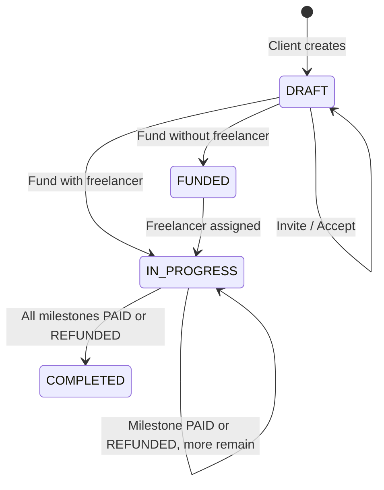
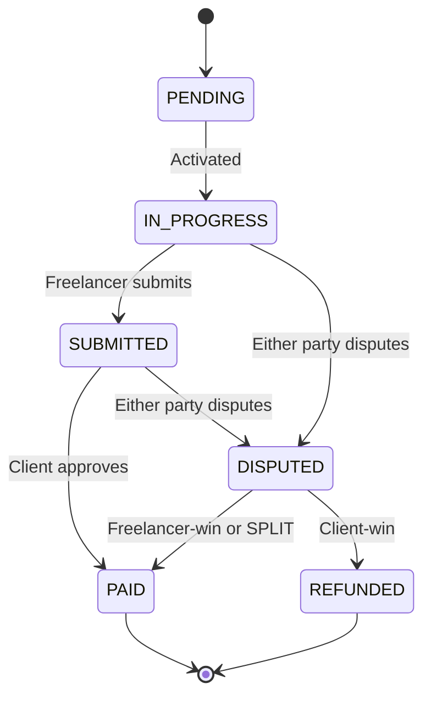

# Project Lifecycle

> **Source of truth for status transitions and who may do what.**  
> Enums: `backend/prisma/schema.prisma`  
> Product scope: see root [README](../README.md)

Phase 1 is simulated escrow (Postgres records lock / payout / refund). Phase 2 replaces the payout layer with an on-chain contract; the status machine below stays the same.

---

## Roles

A user has a global `Role` (`CLIENT`, `FREELANCER`, `ARBITER`, `ADMIN`), but **project actions are determined by project membership**, not only by global role.

| Project role | How assigned | Typical actions |
|--------------|--------------|-----------------|
| **Client** | `project.clientId` — creator | Create, edit (unfunded draft), invite, fund, approve, open dispute |
| **Freelancer** | `project.freelancerId` — invite accept or application accept | Accept/decline invite, apply, submit work, open dispute |
| **Arbiter** | First `ARBITER` user in the DB, set on `project.arbiterId` when a dispute opens | Resolve open disputes |
| **Admin** | Platform role | Same dispute resolve as arbiter; can open a dispute only on `IN_PROGRESS` / `SUBMITTED` like everyone else |

**Rule:** An endpoint must verify the caller is the correct participant on that project (e.g. only `clientId` may fund or approve). Admin is not a silent bypass on milestone status gates.

---

## Happy path

Two ways to hire, then the same work loop:

```
Invite path:     Create (private) → Invite → Accept → Fund → Submit → Approve → …
Job-board path:  Create (public) → Fund → listed → Apply → Accept application → Submit → Approve → …
```

Prefunded public jobs stay `FUNDED` until a freelancer is assigned, then become `IN_PROGRESS` and milestone 0 starts.

---

## Project status (`ProjectStatus`)

| Status | When | Escrow | Next states |
|--------|------|--------|-------------|
| **DRAFT** | Created; not yet funded | `NOT_FUNDED` | `FUNDED` or `IN_PROGRESS` (on fund) |
| **FUNDED** | Client funded; no freelancer yet (job board) | `FUNDED` | `IN_PROGRESS` |
| **IN_PROGRESS** | Freelancer assigned and work is active | `FUNDED` until every milestone is terminal | `COMPLETED` |
| **COMPLETED** | Every milestone is `PAID` or `REFUNDED` | `RELEASED` if any was paid, else `REFUNDED` | — |
| **CANCELLED** | Exists on the enum | — | **Not implemented** (unfunded drafts are **deleted**, not cancelled) |

### Transitions (detail)

| From | To | Trigger | Actor |
|------|----|---------|-------|
| — | `DRAFT` | `POST /api/projects` | **Client** |
| `DRAFT` | `DRAFT` | Invite (`POST …/invite`) — also allowed while `FUNDED` before assignment | **Client** |
| `DRAFT` / `FUNDED` | `DRAFT` / `FUNDED` | Freelancer accepts invite (`POST …/accept`) | **Freelancer** |
| `DRAFT` | `FUNDED` | Fund (`POST …/fund`) with **no** freelancer — job stays listed | **Client** |
| `DRAFT` | `IN_PROGRESS` | Fund with freelancer already assigned — M0 → `IN_PROGRESS` | **Client** |
| `FUNDED` | `IN_PROGRESS` | Application or invite accept on a prefunded job — M0 → `IN_PROGRESS` | **Client** / **Freelancer** |
| `IN_PROGRESS` | `IN_PROGRESS` | A milestone becomes `PAID` or `REFUNDED`; others remain | *System* |
| `IN_PROGRESS` | `COMPLETED` | Last remaining milestone is `PAID` or `REFUNDED` | *System* |

Full edit / delete: only while `DRAFT`, `escrowStatus = NOT_FUNDED`, and `freelancerId` is null.

---

## Milestone status (`MilestoneStatus`)

Milestones are ordered by `orderIndex`. Only **one** milestone should be active (`IN_PROGRESS`, `SUBMITTED`, or `DISPUTED`) at a time.

| Status | When | Who acts next |
|--------|------|---------------|
| **PENDING** | Created with the project; not started | — |
| **IN_PROGRESS** | Active; freelancer may deliver | **Freelancer** → submit; either party may dispute |
| **SUBMITTED** | Delivered; awaiting client | **Client** → approve, or either party → dispute |
| **APPROVED** | Enum only | **Unused** — approve writes `PAID` in the same transaction |
| **PAID** | Payout recorded (`paidAt`, simulated `payoutTxRef`) | — |
| **DISPUTED** | Open dispute; escrow stays locked | **Arbiter** or **Admin** → resolve |
| **REFUNDED** | Client-win dispute (or all-refund completion) | — |

### Transitions (detail)

| From | To | Trigger | Actor |
|------|----|---------|-------|
| — | `PENDING` | Project created with milestones | **Client** |
| `PENDING` | `IN_PROGRESS` | Fund with freelancer, accept on prefunded job, or previous milestone terminal | *System* |
| `IN_PROGRESS` | `SUBMITTED` | `POST /api/milestones/:id/submit` | **Freelancer** |
| `SUBMITTED` | `PAID` | `POST /api/milestones/:id/approve` | **Client** |
| `IN_PROGRESS` / `SUBMITTED` | `DISPUTED` | `POST /api/projects/:id/disputes` | **Client** or **Freelancer** (or **Admin**) |
| `DISPUTED` | `PAID` | Resolve `RESOLVED_FREELANCER` (100%) or `SPLIT` (half) | **Arbiter** / **Admin** |
| `DISPUTED` | `REFUNDED` | Resolve `RESOLVED_CLIENT` | **Arbiter** / **Admin** |
| `PAID` / `REFUNDED` | next `PENDING` → `IN_PROGRESS` | If another milestone remains | *System* |

### Submission rules

- Only the assigned **freelancer** on an `IN_PROGRESS` milestone may submit.
- `content` minimum 50 characters; `fileUrl` optional (PDF, ZIP, raster image, or text; max 10 MB).
- Re-submit is a new `Submission` row with incremented `version` (milestone stays `SUBMITTED`).

---

## Disputes (`DisputeStatus`)

Implemented in Phase 1 (simulated money). Opening requires at least one user with role `ARBITER`; otherwise the API returns 409.

| Outcome | Milestone | Money (simulated) |
|--------|-----------|-------------------|
| `RESOLVED_FREELANCER` | `PAID` | Full milestone amount to freelancer |
| `RESOLVED_CLIENT` | `REFUNDED` | Full amount treated as returned to client |
| `SPLIT` | `PAID` (split metadata) | Half to freelancer (rounded down); leftover cent stays with the client |

Rules:

- Project must be `FUNDED` or `IN_PROGRESS`.
- Milestone must be `IN_PROGRESS` or `SUBMITTED` (including when an admin opens).
- One open dispute per project (`OPEN` or `IN_REVIEW`). Opening writes `OPEN`.
- Freelancer and client are notified; the assigned arbiter is notified too.
- Resolve is claimed with `updateMany` so a double-click cannot pay twice.

Escrow does **not** jump to `RELEASED` after a single paid milestone. It stays `FUNDED` until **every** milestone is `PAID` or `REFUNDED`.

---

## Escrow status (`EscrowStatus`)

Parallel to project status; tracks money state (simulated in Phase 1).

| Status | When |
|--------|------|
| `NOT_FUNDED` | Draft, no deposit |
| `FUNDED` | Client funded; budget locked — **including** after some (but not all) milestones are paid or refunded |
| `RELEASED` | Project completed and at least one milestone was `PAID` |
| `REFUNDED` | Project completed and every milestone was `REFUNDED` |

---

## Action matrix

| Action | Actor | Preconditions | API | Status change |
|--------|-------|---------------|-----|---------------|
| Create project | **Client** | Logged in as client | `POST /api/projects` | → `DRAFT` |
| Edit project | **Client** | `DRAFT`, not funded, no freelancer | `PATCH /api/projects/:id` | — |
| Invite freelancer | **Client** | `DRAFT` or `FUNDED`, no freelancer | `POST …/invite` | — |
| Accept / decline invite | **Freelancer** | Pending invite | `POST …/accept` or `…/decline` | `freelancerId` set on accept |
| Fund project | **Client** | `DRAFT`, not yet funded | `POST …/fund` | Escrow → `FUNDED`; project → `FUNDED` or `IN_PROGRESS` |
| Apply (job board) | **Freelancer** | Public, escrow `FUNDED`, no freelancer | `POST …/apply` | — |
| Accept application | **Client** | Pending application, project still open | `POST …/applications/:id/accept` | Same assignment as invite accept |
| Submit work | **Freelancer** | Milestone `IN_PROGRESS` | `POST …/milestones/:id/submit` | → `SUBMITTED` |
| Approve & release | **Client** | Milestone `SUBMITTED` | `POST …/milestones/:id/approve` | → `PAID` (no `APPROVED` row) |
| Open dispute | **Client** or **Freelancer** | Active/submitted milestone, no other open dispute, an arbiter exists | `POST …/disputes` | Milestone → `DISPUTED` |
| Resolve dispute | **Arbiter** or **Admin** | Dispute `OPEN` / `IN_REVIEW` | `POST …/disputes/:id/resolve` | See outcomes above |
| Review | Either party | Project `COMPLETED`, one review each | `POST …/reviews` | — |

### UI visibility (buttons hidden when)

| Surface | Role | Primary | Hidden when |
|---------|------|---------|-------------|
| MilestoneCard | Freelancer | Submit work | status ≠ `IN_PROGRESS` |
| MilestoneCard | Client | Review & approve | status ≠ `SUBMITTED` |
| Project detail | Client | Fund project | not `DRAFT` |
| Project detail | Client | Invite freelancer | freelancer already set, or not `DRAFT`/`FUNDED` |
| ProjectCard | Freelancer (pending) | Accept invite | already accepted |

---

## State diagram

### Project



### Milestone (single)



---

## Notifications & activity log

| Event | `NotificationType` | Recipient |
|-------|-------------------|-----------|
| Invited to project | `PROJECT_INVITED` | Freelancer |
| Invite cancelled / displaced | `INVITE_CANCELLED` | Previous invitee |
| Invite declined | `INVITE_DECLINED` | Client |
| Application received / accepted / rejected | `APPLICATION_*` | Client or freelancer |
| Work submitted | `MILESTONE_SUBMITTED` | Client |
| Milestone approved | `MILESTONE_APPROVED` | Freelancer |
| Dispute raised | `MILESTONE_DISPUTED` | Counterparty + arbiter |
| Dispute resolved | `DISPUTE_RESOLVED` | Client and freelancer |
| Payment released | `PAYMENT_RELEASED` | Freelancer |
| Review received | `REVIEW_RECEIVED` | Subject |

`ActivityLog.action` examples: `PROJECT_CREATED`, `FREELANCER_INVITED`, `FREELANCER_ACCEPTED`, `PROJECT_FUNDED`, `MILESTONE_SUBMITTED`, `MILESTONE_APPROVED`, `MILESTONE_PAID`, `MILESTONE_DISPUTED`, `MILESTONE_REFUNDED`, `DISPUTE_RESOLVED`, `PROJECT_COMPLETED`.

---

## Not built yet (schema may still have the enum)

| Feature | Statuses involved | Notes |
|---------|-------------------|--------|
| Project cancel after create | `CANCELLED` | Unfunded drafts are deleted instead |
| Milestone `APPROVED` as a stored status | `APPROVED` | Approve goes `SUBMITTED` → `PAID` |
| Dispute `IN_REVIEW` as a written status | `IN_REVIEW` | Treated as still-open if present; open writes `OPEN` |
| Real escrow / wallet | `payoutTxRef` | Phase 2 (Solidity) |
| Client reject without dispute | — | Not implemented; use dispute or wait for approve |

---

## Resolved vs still open

- Approve **does** skip `APPROVED` and go straight to `PAID` in one transaction.
- Freelancer may submit again while the milestone is `SUBMITTED` (new version). There is no `REVISION` status.
- Client cannot send a submission back to `IN_PROGRESS` without a dispute.
- Job board: `isPublic` + escrow `FUNDED` + no freelancer. Unfunded public drafts are **not** listed.

---

## Related docs

- [README](../README.md) — product overview, API, deploy
- `backend/prisma/schema.prisma` — enum definitions
